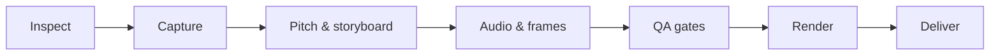

<div align="center">

# Power Presentation

**Product presentation videos from your repository — inside Claude Code.**

[](https://github.com/godmarch33/power-presentation/actions/workflows/ci.yml)
[](https://github.com/godmarch33/power-presentation/releases)
[](LICENSE)
[](https://docs.claude.com/en/docs/claude-code/plugins)

</div>

`power-presentation` is a Claude Code plugin that turns a product into a short presentation video for
**marketing, sales or investors**. Point it at a repository, a live URL or a screen recording — or at a product
with no UI at all (CLI, API, SDK, data/ML, design mocks, docs) — and it inspects the product, records it, writes
the story and renders an MP4 with [HyperFrames](https://github.com/heygen-com/hyperframes).

> [!NOTE]
> Alpha (0.3.1). The full pipeline works end to end; per-scene re-rendering and the Workflow-based
> orchestration are planned for v1.

## Features

- **Three audiences, one command** — length, hook, pacing, voice-over, loudness and call to action follow the mode.
- **Records the real product** — production URL first, then staging, a local build or your recording; CLI tools
  are recorded from their VHS tapes, APIs and SDKs get code, terminal and API-card scenes.
- **No invented facts** — every number, logo and quote on screen is traced to a file line or a URL.
- **Quality gates** — 14 checks on the rendered video (hook within 3 s, frozen frames, loudness, reading speed,
  caption safe area, …), a 0–100 score and an optional three-vote vision review.
- **Private by default** — captured frames pass an OCR + gitleaks secret check; `--privacy local` turns off
  every cloud service and telemetry.
- **Stays out of your way** — everything a run produces goes to `power-presentation-out/`, which git ignores.

## Installation

```bash
cd your-project
claude plugin marketplace add godmarch33/power-presentation --scope project
claude plugin install power-presentation@power-presentation --scope project
```

The first session installs the video toolchain (HyperFrames CLI, headless Chrome, Playwright and, if missing,
ffmpeg — about 1.7 GB) into the plugin's data directory.

## Usage

```text
/power-presentation:present                                        # scan the project, ask a few questions, render
/power-presentation:present --for marketing --duration 45 --repo   # build the video from this repository
/power-presentation:present --for sales --url https://example.com --prospect prospect.json
```

The result lands in `power-presentation-out/<product>-<mode>/renders/final/`: the 16:9 master, a 9:16 cut, SRT
captions and a poster, plus `share-copy.txt` and `run-report.json`. A run interrupted by a usage limit continues
on the next `/present`.

| Option | Description |
|---|---|
| `--for marketing\|sales\|investors` | Audience mode |
| `--duration <10–180>` | Length in seconds; each mode has a recommended band |
| `--repo [path]`, `--url`, `--staging-url`, `--local`, `--recording <file>` | Where the product comes from |
| `--format 16:9,9:16` | Output formats (16:9 is always rendered) |
| `--voice` | Voice-over (on by default for sales and investors) |
| `--brand <dir\|json>`, `--preset <name>` | Brand kit or design preset |
| `--prospect <file>`, `--pain <text>` | Sales: who the video is for and the problem it opens with |
| `--metrics <csv\|xlsx>` | Investors: traction numbers with source and date |
| `--privacy local` | No cloud calls; the network manifest is shown first |
| `--budget <usd>`, `--no-critic`, `--yes`, `--new` | Token ceiling, skip the vision review, accept defaults, start over |

Other commands: `/power-presentation:present-edit` (change one thing and re-render),
`present-qa` (run the quality gates) and `present-render` (render the current project).

Plugin options: `model_mix` (`economy`, `all-sonnet`, `opus-orchestrator`,
`all-opus`), `critic`, `privacy`, `budget_usd`, `brand_kit_dir` and optional HeyGen / ElevenLabs keys.
Use `economy` on smaller subscriptions.

## How it works



1. **Inspect** detects the product type and extracts the story and every claim with its source.
2. **Capture** records the product with auto-zoom and a synthetic cursor, and redacts secrets.
3. **Pitch & storyboard** — a story-director agent proposes concepts, you pick one, it writes the storyboard and script.
4. **Audio & frames** — offline voice-over (Kokoro), music and SFX; frame-worker agents build each scene in HTML.
5. **QA gates** check the assembled video before and after rendering; failing scenes go back for one fix round.
6. **Render & deliver** — HyperFrames renders the formats; the plugin bakes the poster and writes the share copy.

## Requirements

- [Claude Code](https://docs.claude.com/en/docs/claude-code) with plugin support
- Node.js ≥ 22 and Python 3
- ~2 GB of disk for the toolchain; optional Kokoro (voice-over) and whisper.cpp (captions) add ~0.8 GB of models

Developed and tested on Linux.

## Development

```bash
git clone https://github.com/godmarch33/power-presentation.git && cd power-presentation
claude --plugin-dir .            # load the plugin from this checkout
npm test                         # unit and fixture tests
claude plugin validate --strict .
```

There are no npm dependencies. The layout: `skills/` (the slash commands), `agents/` (story director, frame
workers, critics), `hooks/`, `scripts/` (the pipeline, with tests next to each script), `vendor/` (the pinned
HyperFrames workflow), `examples/` and `evals/` (golden-set fixtures and evaluation cases). See
[CONTRIBUTING.md](CONTRIBUTING.md) for the full workflow.

## License

[MIT](LICENSE). Built on [HyperFrames](https://github.com/heygen-com/hyperframes) (Apache-2.0) with ideas and
files from [brag](https://github.com/latent-spaces/brag) (MIT); see [THIRD_PARTY_NOTICES.md](THIRD_PARTY_NOTICES.md).
